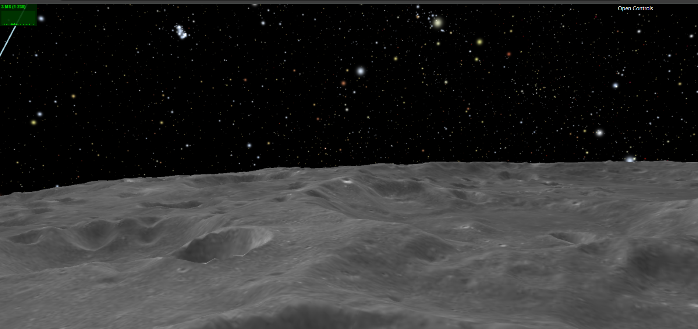
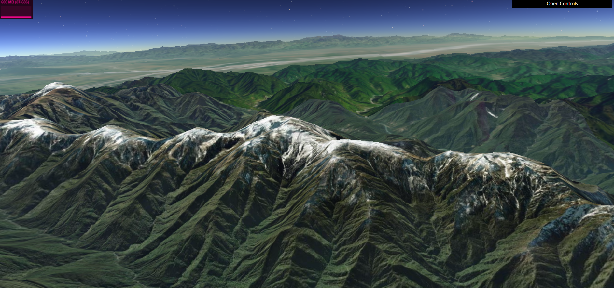
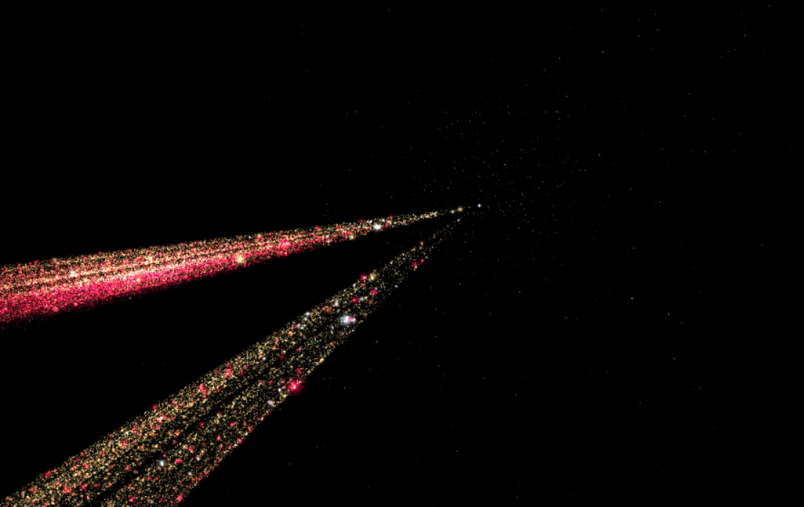
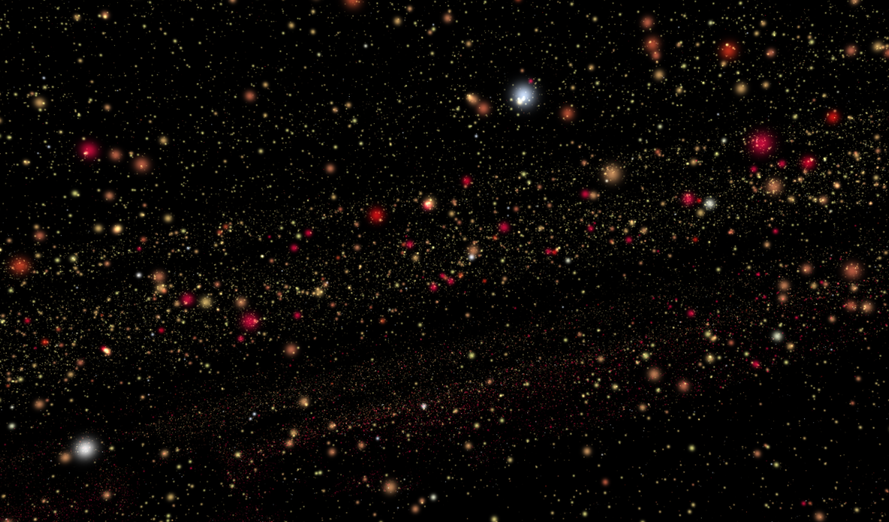

# AstroVis

This project aims to visualize various astronomical datasets, including the surface, terrain, and other features of celestial bodies, as well as star catalogs.

Currently, we support uploading customized star catalog datasets in CSV format for visualization. Ensure that the first three columns contain the positional data of the stars. Additional attributes such as BV color index, luminosity, absolute magnitude, velocity, and speed can be visualized using different color mappings. More visualization features are on the way.

Layer uploading is also coming soon, allowing users to visualize their own terrain, surface, and other planetary data, such as Earth’s and Moon's features.

Visit our website at http://121.40.212.118:5000/ to explore the system.

